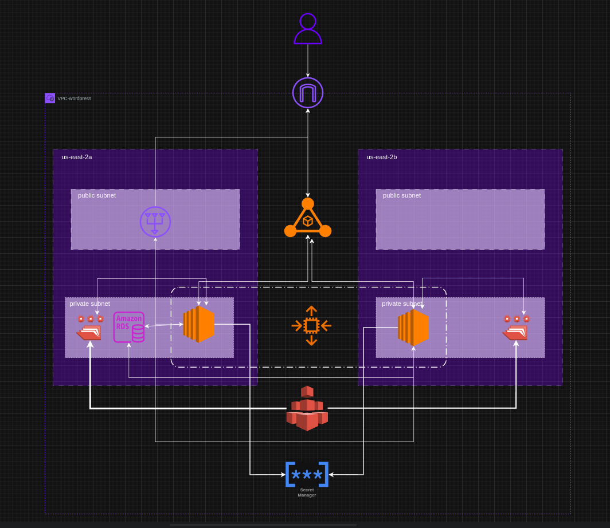
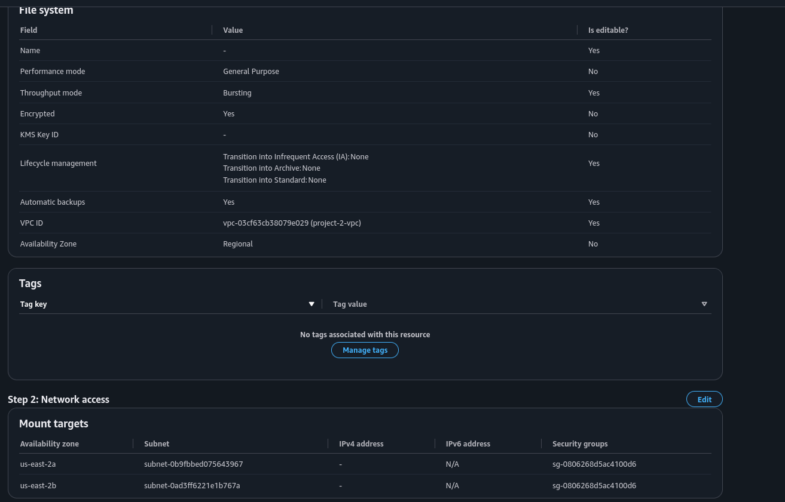

# 🚀 WordPress High Availability na AWS

<p align="center">
  
  
  
  
  
  
  
  
</p>

---

Bem-vindo ao projeto **WordPress High Availability na AWS**! Este repositório provisiona uma infraestrutura robusta, escalável e segura para hospedar o WordPress utilizando os principais serviços gerenciados da AWS. Tudo isso com deploy automatizado via Docker! 🐳

---
## 📚 Sumário

<details open>
  <summary><strong>Clique para navegar pelas seções</strong></summary>

- [📦 Visão Geral da Arquitetura](#📦-visão-geral-da-arquitetura)
- [🛠️ Tecnologias Utilizadas](#🛠️-tecnologias-utilizadas)
- [✨ Objetivo](#✨-objetivo)
- [📋 Pré-requisitos](#📋-pré-requisitos)
- [📝 Como Reproduzir o Projeto](#📝-como-reproduzir-o-projeto)
  - [1️⃣ Clonando o Repositório](#1️⃣-clonando-o-repositório)
  - [2️⃣ Criando VPC com NAT Gateway](#2️⃣-criando-vpc-com-nat-gateway)
  - [3️⃣ Criando IAM Role para Launch Template](#3️⃣-criando-iam-role-para-launch-template)
  - [4️⃣ Criar RDS com MySQL](#4️⃣-criar-rds-com-mysql)
  - [5️⃣ Criar EFS](#5️⃣-criar-efs)
  - [6️⃣ Criando o Secrets Manager](#6️⃣-criando-o-secrets-manager)
  - [7️⃣ Criando o Launch Template](#7️⃣-criando-o-launch-template)
- [⚙️ Explicando o Script User Data](#⚙️-explicando-o-script-user-data)

</details>

## 📦 Visão Geral da Arquitetura




---

## 🛠️ Tecnologias Utilizadas

- **AWS EC2** 🖥️ — Instâncias para hospedar containers Docker
- **Docker** 🐳 — Containerização do WordPress
- **Elastic Load Balancer (ELB)** ⚖️ — Balanceamento de carga
- **Amazon EFS** 📂 — Armazenamento compartilhado entre instâncias
- **Amazon RDS** 🗄️ — Banco de dados gerenciado (MySQL/PostgreSQL)
- **AWS Secrets Manager** 🔐 — Gerenciamento seguro de credenciais
- **Auto Scaling Group** 📈 — Escalabilidade automática das instâncias

---

## ✨ Objetivo

Prover uma solução WordPress altamente disponível, resiliente e fácil de gerenciar na AWS, pronta para produção!

---

## 📋 Pré-requisitos

- Conta AWS
- AWS CLI configurado
- Docker instalado

---

## 📝 Como Reproduzir o Projeto

### 1️⃣ Clonando o Repositório

```bash
git clone https://github.com/Ruan-Pablo-Oli/wordpress-high-availability-aws.git
cd wordpress-high-availability-aws
```

### 2️⃣ Criando VPC com NAT Gateway

**Acesse o serviço VPC no AWS Console**

- Crie uma VPC com duas subnets públicas e duas privadas.
- Para alta disponibilidade, crie um NAT Gateway por zona de disponibilidade. Para economizar, apenas um NAT Gateway em uma rede pública.
- Crie 4 security groups:
    - `secg-elb-public` → Permitir entrada de tráfego HTTP e HTTPS de qualquer IP
    - `secg-wordpress-app` → Permitir acesso HTTP/HTTPS do ELB e acesso ao EFS
    - `secg-rds` → Permitir entrada de tráfego MYSQL/AURORA na porta 3306, para o **secg-wordpress-app**

    - `secg-efs` → Permitir acesso NFS das instâncias EC2 com **secg-wordpress-app**

### 3️⃣ Criando IAM Role para Launch Template

**Acesse o serviço IAM no AWS Console**

- Crie uma role `EC2RoleForWordpressSSMAndSecret`
  - Adicione as policies gerenciadas `AmazonSSMManagedInstanceCore` e `SecretsManagerReadWrite`
- Atribua essa role ao Launch Template posteriormente

### 4️⃣ Criar RDS com MySQL

**Acesse o serviço de RDS no AWS Console**

- Crie um database com engine MySQL
- Defina um nome para instância
- Defina um master username (ex: `wordpressproject`)
- Defina uma master password (ex: `wordpress_password`)
- Escolha o tipo de instância desejado
- Em connectivity, selecione a VPC criada anteriormente
- Não permita acesso público
- Escolha o security group `secg-rds`
- Crie um banco de dados inicial chamado `wordpressdb`

### 5️⃣ Criar EFS 

**Acesse o serviço EFS no console**

- Crie um efs
- Clique em customize
- Escolha um nome
- Clique em next
- Escolha a vpc criada
- Coloque os dois pontos de montagem um em cada subnet privada
- Escolha o security group, secg-efs-nfs
- Clique em next e em create



---

### 6️⃣ Criando o Secrets Manager

**Acesse o serviço AWS Secrets Manager no console**

- Clique em "Store a new secret"
- Selecione "Credentials for Amazon RDS database"
- Adicione usuário e senha do banco
- Nomeie o secret como `creds/wordpress/rds` (ou ajuste o script se usar outro nome)
- Não é necessário configurar rotation

---

### 7️⃣ Criando o Launch Template

**Acesse o serviço EC2 no console**

- Crie um novo Launch Template
- Selecione a AMI (Amazon Linux 2)
- Escolha o tipo de instância (ex: t2.micro)
- Selecione o security group `secg-wordpress-app`
- Anexe a IAM Role criada anteriormente
- Configure o User Data para instalar Docker, montar o EFS e rodar o container WordPress (veja script abaixo)
- Ajuste variáveis como ID do EFS, região, caminho do secret e nome do banco conforme necessário
- Salve o template

---


### 8️⃣ Criando o Auto Scaling Group

**Acesse o serviço EC2 > Auto Scaling Groups**

- Crie um novo Auto Scaling Group usando o Launch Template criado
- Selecione a VPC criada
- Escolha as duas subnets privadas
- Anexe a um novo Application Load Balancer (internet facing)
- Selecione as duas subnets públicas para o Load Balancer
- Em default routing, escolha para criar um novo target group
- Defina desired capacity como 2, min 2, max 4
- Escolha Target Tracking scaling policy
- Finalize a criação

---

### 9️⃣  Configurações finais

**Target Group**

- Acesse o Target Group criado
- Em "Actions" > "Edit target group attributes", ative "stickiness" para manter sessões do WordPress
- Em health checks, clique em edit
- Expanda advanced health check settings
- Em sucess code coloque 200-399

**Load Balancer**

- Selecione o Load Balancer criado
- Na aba "Security", altere para o grupo `secg-elb-public`
- Copie o DNS do Load Balancer e acesse no navegador para testar

---

## ⚙️ Explicando o Script User Data

O **User Data** é executado automaticamente em cada nova instância EC2 criada pelo Auto Scaling Group. Ele:

- Instala Docker e dependências
```bash
    echo "A atualizar pacotes e a instalar dependências..."
    dnf update -y
    dnf install -y docker amazon-efs-utils jq 
    curl -SL "https://github.com/docker/compose/releases/latest/download/docker-compose-linux-$(uname -m)" \
    -o /usr/libexec/docker/cli-plugins/docker-compose
    chmod +x /usr/libexec/docker/cli-plugins/docker-compose

    echo "A iniciar e a habilitar o serviço Docker..."
    systemctl start docker
    systemctl enable docker
    usermod -a -G docker ec2-user

```
- Monta o EFS para arquivos compartilhados do WordPress
```bash
    SECRET_NAME="creds/wordpress/rds"
    AWS_REGION="us-east-2" # SUBSTITUA PELA SUA REGIÃO
    EFS_ID="" # SUBSTITUA PELO SEU ID DO EFS
    echo "A criar ponto de montagem para o EFS..."
    mkdir -p /mnt/efs/wordpress
    EFS_DNS_NAME="$EFS_ID.efs.$AWS_REGION.amazonaws.com"

    echo "$EFS_DNS_NAME:/ /mnt/efs/wordpress nfs4 nfsvers=4.1,rsize=1048576,wsize=1048576,hard,timeo=600,retrans=2,noresvport,_netdev 0 0" >> /etc/fstab

    echo "A montar todos os sistemas de ficheiros..."
    mount -a
    while ! grep -qs '/mnt/efs/wordpress' /proc/mounts; do
    echo "A aguardar pela montagem do EFS em /mnt/efs/wordpress..."
    sleep 5
    done
    echo "A criar diretório para o projeto WordPress..."
    mkdir -p /home/ec2-user/wordpress-docker

```
- Obtém credenciais do Secrets Manager

```bash
    echo "A ir buscar as credenciais do RDS ao Secrets Manager..."
    SECRET_JSON=$(aws secretsmanager get-secret-value --secret-id $SECRET_NAME --region $AWS_REGION --query SecretString --output text)

    DB_HOST=$(echo $SECRET_JSON | jq -r .host)
    DB_USER=$(echo $SECRET_JSON | jq -r .username)
    DB_PASSWORD=$(echo $SECRET_JSON | jq -r .password)
    DB_NAME="wordpressdb" # Pode definir o nome da BD aqui ou no segredo

    echo "Credenciais obtidas. A criar o ficheiro compose.yml..."

```

- Baixa e executa o container Docker do WordPress, já configurado para conectar ao RDS e usar o EFS
    ```bash
        cat <<EOF > /home/ec2-user/wordpress-docker/compose.yml
        services:
        wordpress:
            image: wordpress:latest
            restart: always
            ports:
            - "80:80"
            environment:
            WORDPRESS_DB_HOST: ${DB_HOST}:3306
            WORDPRESS_DB_USER: ${DB_USER}
            WORDPRESS_DB_PASSWORD: '${DB_PASSWORD}'
            WORDPRESS_DB_NAME: ${DB_NAME}
            volumes:
            - /mnt/efs/wordpress:/var/www/html/wp-content/uploads
        EOF

        echo "Ficheiro compose.yml criado."

        echo "A ajustar permissões para o EFS e para o Docker..."
        chown 33:33 /mnt/efs/wordpress
        chown -R ec2-user:ec2-user /home/ec2-user/wordpress-docker

        echo "A iniciar o container do WordPress..."
        su - ec2-user -c "cd /home/ec2-user/wordpress-docker && docker compose up -d"

        echo "Script de User Data concluído."
    ```
**Pontos de atenção ao editar o script:**
- Altere o ID do EFS para o seu
- Ajuste a região (`AWS_REGION`) conforme sua configuração
- Modifique o caminho do secret se necessário
- Confirme o nome do banco de dados

---
